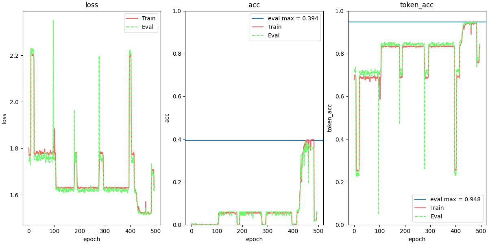
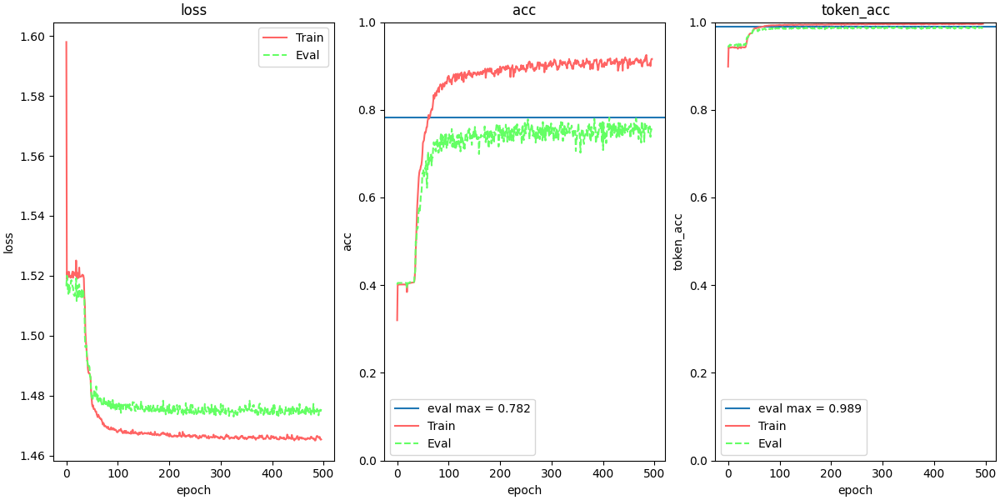
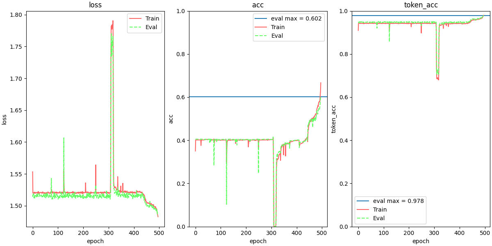

# ADL HW 1 report
### Q1 Data processing
1. Describe how do you use the data for intent_cls.sh, slot_tag.sh: 
    - How do you tokenize the data.
    
        使用 sample code `preprocess_intent.py` / `preprocess_slot.py` to tokenize the data.
        - intent
            - intent
                
                歷遍所有 intent 並給予每一個不同的 intent 一個唯一的 ID  。
                
            - words
                
                以 ' '(空格) 句子分割為 tokens ，並從所有的 token 中選出最常出現的數個 tokens 給予唯一的 ID 。
                
                
        - slot
            - tags
                    
                    歷遍所有的 tag 並給予每一個不同的 tag 一個獨立的 ID 。
            - tokens
                    
                    歷遍所有的 token ，並從中選出最常出現的數個 tokens 給予唯一的 ID 。
        
    - The pre-trained embedding you used.
    
        glove.840B.300d
        
2. If you use the sample code, you will need to explain what it does in your own ways to answer Q1.
\pagebreak

### Q2 Describe your intent classification model
1. Describe
    - your model
        
        Input: A sequence of tokens, S
        
        Output: Predict class of the input, K
    
        $\vec{h_t}, \vec{c_t} = LSTM(\vec{w_t}, \vec{h_{t-1}}, \vec{c_{t-1}})$, where w_t is the word embedding of $t_{th}$ token in sequence S.
    
        $\vec{v}$ = $softmax(A\vec{h_n})$, where A repersents a full connected layer and  n = |S|-1.
    
        K = $max_{0\le i < m}\ v_i$, where $v_i$ is the $i_{th}$ element of $\vec{v}$ and m is the number of classes.
    
    - performance of your model. (public score on kaggle)
    
        0.87644

    - the loss function you used.
        
        Cross entropy
    - The optimization algorithm (e.g. Adam), learning rate and batch size.
        
        Optimization algorithm: Adam
        learning rate: $10^{-5}$
        batch size: 128
\pagebreak

### Q3 Describe your slot tagging model
1. Describe 
    - your model 
    
        Input: A sequence of tokens, S
        
        Output: A sequence of tags, T
    
        $\vec{h_t} = GRU(\vec{w_t}, \vec{h_{t-1}}, \vec{c_{t-1}})$, where $w_t$ is the word embedding of $t_{th}$ token of sequence S.
    
        
        $\vec{v_t}$ = $softmax(A\vec{h_t}) \forall t \in [0, n)$, where A repersents a full connected layer and n = |S|.
    
        $t_i$ = $max_{0\le i < m}\ v_i^t$, where $v_i^t$ is the $i_{th}$ element of $\vec{v_t}$ and m is the number of classes of tag.
    
        T = [$t_i$ | $\forall i \in [0, n)$], where n = |S|.
        
    - performance of your model. (public score on kaggle)
    
        0.73887

        
    - the loss function you used.
    
        Cross entropy
        
    - The optimization algorithm (e.g. Adam), learning rate and batch size.
        
        Optimization algorithm: AdamW
        
        learninig rate: $10^{-3}$
        
        batch size: 128
\pagebreak

### Q4 Sequence Tagging Evaluation
- Please use seqeval to evaluate your model in Q3 on validation set and report classification_report(scheme=IOB2, mode=’strict’).
```
              precision    recall  f1-score   support

        date       0.73      0.71      0.72       206
  first_name       0.90      0.81      0.86       102
   last_name       0.81      0.67      0.73        78
      people       0.73      0.73      0.73       238
        time       0.83      0.86      0.84       218

   micro avg       0.78      0.76      0.77       842
   macro avg       0.80      0.76      0.78       842
weighted avg       0.78      0.76      0.77       842
```

- Explain the differences between the evaluation method in seqeval, token accuracy, and joint accuracy.

    - seqeval: 比較每個 tag 出來的片段，並計算片段預測的正確率。
    - token accuracy: 以 token 為單位計算正確率。
    - joint accuracy: 以句子為單位，只要句子中出現任何錯誤就被視為是錯誤的。
\pagebreak

### Q5 Compare with different configurations
- Please try to improve your baseline method (in Q2 or Q3) with
different configuration (includes but not limited to different number of
layers, hidden dimension, GRU/LSTM/RNN) and EXPLAIN how
does this affects your performance / speed of convergence / ...
- Some possible BONUS tricks that you can try: multi-tasking,
few-shot learning, zero-shot learning, CRF, CNN-BiLSTM
- This question will be grade by the completeness of your experiments
and your findings.

主要嘗試調整 RNN 模型， hidden size 以及 num layers　。

RNN 使用了 LSTM 與 GRU 兩種， hidden size 嘗試了400, 512, 600 三種設定， num layers 則測試了 2 與 4 層。

每種設定分別紀錄三種參數: loss, joint accuracy, token accuracy 。再接下來的圖表中分別紀錄為 loss, acc, token_acc 。

接下來會將 joint accuracy 簡稱為 accuracy 。

嘗試後，發現最好的設定是:

- RNN: GRU

- hidden size: 600

- num layers: 2


在此設定下，可以在 evaluation set 達到 79.4% 的 accuracy 。

然而，在 kaggle 的 public score 中只獲得 76% 的 accuracy 。

使用下面的設定:

- RNN: GRU

- hidden size: 512

- num layers: 2


則可以在 kaggle 的 public score 中獲得 77.9% 的 accuracy 。

其他實驗的結果如下，圖片的命名方式為 `{RNN}_{hidden size}_{num layers}` 。










簡單總結，可以發現 GRU 的整體表現優於 LSTM 。且當 hidden size 過小時， accuracy 會無法提昇，推測是模型的複雜度不夠所導致。
此外 num layers 使用 2 層可以達到較佳得效果。當 hidden size 與 num layers 過大時反而會對 accuracy 造成影響。

最後，透過 token accuracy 可以觀察到一個有趣的現象。幾乎在所有設定下， token accuracy 在訓練初期就可以達到不錯的成績，然而 joint accuracy 並未有相應的高度。

推測是錯誤的 token 分散在不同 sequence 中，進而導致此現象。

然而，使用 cross entropy 只單純的比對各個 token 的正確性，無法有效的表達 joint accuracy 的正確率。也許可以針對此問題設計 loss function 來解決。